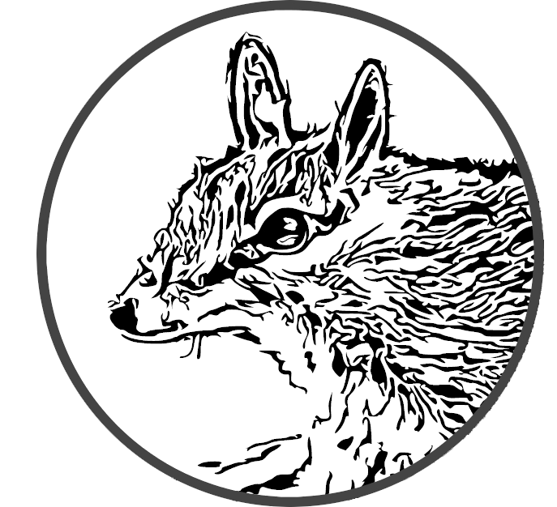

# Numbat



Numbat is an API to create and manipulate Sourcetrail databases. [Sourcetrail](https://github.com/CoatiSoftware/Sourcetrail) is a code source
explorer which allows users to navigate through the different components (functions, classes, types, etc.) easily.

Numbat main goal is to offer a full-python SDK given the fact that the current one, SourcetrailDB cannot be used anymore efficiently. It is not user-friendly at first sight, need to be compiled to provide Python bindings and, moreover, it is no longer maintained. Finally, we have added some little new features as finding an element in the database.

With Numbat, you will be able to visualize your data quickly with the nice graphical Sourcetrail interface. For example, [Pyrrha](https://quarkslab.github.io/pyrrha/) uses Numbat to map firmware structure.


## Installation

Numbat is available on `pypi`.
```bash
pip install numbat
```

### From sources
You can also install it from the `git` repository. Either using the following oneliner:
```bash
pip install 'numbat @ git+https://github.com/quarkslab/numbat'
```
or doing it in few steps:
```bash
# Download the repo
git clone git@github.com:quarkslab/numbat.git
cd numbat
# Install numbat locally
pip install .
```

### Build Documentation
If you want to build the documentation by first installing Numbat with the required `[doc]` dependencies and then serve the documentation on a local server.

```bash
# if you already have a local clone of the project
cd NUMBAT_DIR
pip install .[doc]

# otherwise
pip install 'numbat[doc]'

# serve doc locally
mkdocs serve
```

## Basic Usage

A complete usage with examples is available in the [documentation](https://quarkslab.github.io/numbat/tutorial/) but here is a quick usage to begin with Numbat.

To use Numbat, you must first create a `SourcetrailDB` object and either create a new database or open an existing one:

```python
from pathlib import Path
from numbat import SourcetrailDB

# Create DB
db = SourcetrailDB.open(Path('my_db'), clear=True)

# Create a first class containing the method 'main'
my_main = db.record_class(name="MyMainClass")
meth_id = db.record_method(name="main", parent_id=my_main)

# Create a second class with a public field 'first_name'
class_id = db.record_class(name="PersonalInfo")
field_id = db.record_field(name="first_name", parent_id=class_id)

# The method 'main' is using the 'first_name' field
db.record_ref_usage(meth_id, field_id)

# Save modifications and close the DB
db.commit()
db.close()
```

## Authors & Maintainers

### Current
- Sami Babigeon (@sbabigeon), Quarkslab
- Eloïse Brocas (@ebrocas), Quarkslab

### Past
- Pascal Wu (@pwu42), during his internship at Quarkslab

The logo is a creation of Benoît Forgette and Sami Babigeon.
